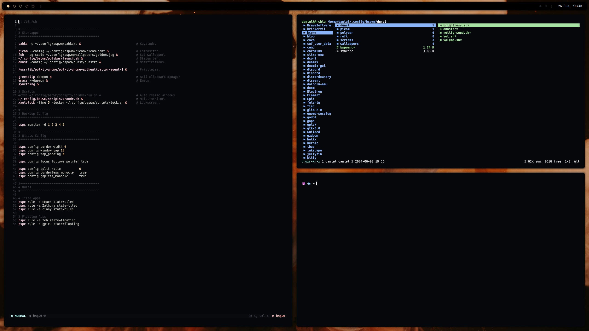

# 📁 .files
## :mag: Specifications

| Feature              | Package                                                 |
| -------------------- | ------------------------------------------------------- |
| Window Manager       | [`bspwm`](https://github.com/baskerville/bspwm)         |
| Compositor           | [`picom-jonaburg-fix`](https://github.com/Arian8j2/picom-jonaburg-fix)   |
| Terminal             | [`kitty`](https://github.com/alacritty/alacritty)   |
| Shell                | [`fish`](https://fishshell.com/)                        |
| Editor               | [`nvchad`](https://nvchad.com/)                         |
| Panel                | [`polybar`](https://github.com/polybar/polybar)         |
| Notification Manager | [`dunst`](https://github.com/dunst-project/dunst)       |
| Application Launcher | [`rofi`](https://github.com/davatorium/rofi)            |

## :camera: Showcase

| 😶‍🌫️ Nothing |
|:-:|
||

| 🀄️ Tiled (nvim, ranger, kitty) |
|:-:|
||
